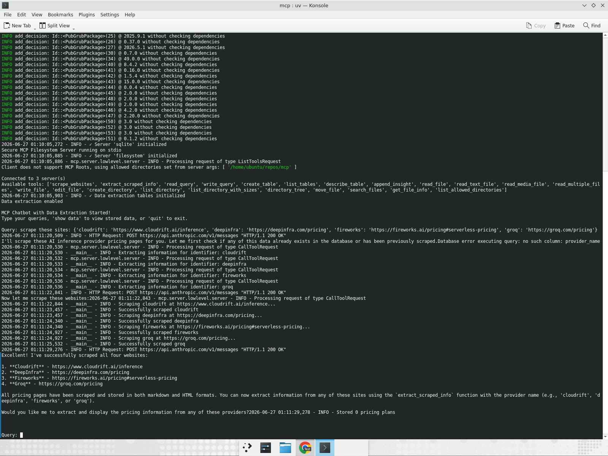
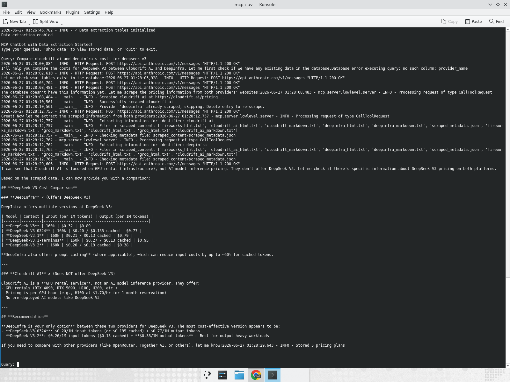
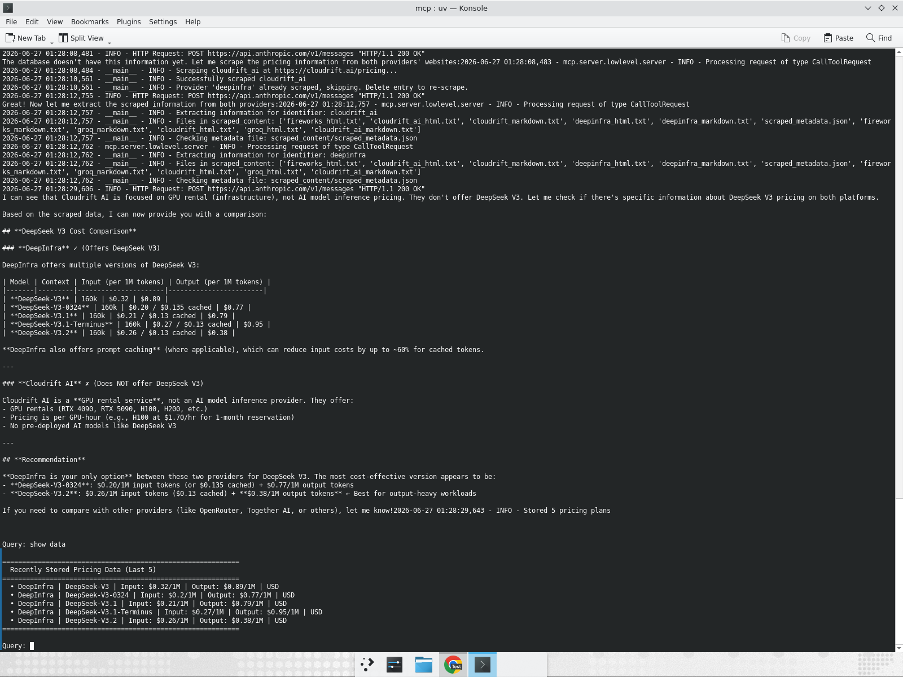

# MCP Chatbot Test Evidence

## Test 1: Scrape 4 Websites

**Query:** `scrape these sites: {'cloudrift': 'https://www.cloudrift.ai/inference', 'deepinfra': 'https://deepinfra.com/pricing', 'fireworks': 'https://fireworks.ai/pricing#serverless-pricing', 'groq': 'https://groq.com/pricing'}`

**Expected:** All 4 sites scraped successfully, agent checks database first before scraping.

**Result:** All 4 websites scraped successfully. Agent first checked the database for existing data, then checked for previously scraped content, and only scraped after confirming no cached data existed.

---

## Test 2: Compare Pricing (Using Cached Data)

**Query:** `Compare cloudrift ai and deepinfra's costs for deepseek v3`

**Expected:** Agent checks DB first, uses cached scraped data (no re-scraping for sites already scraped), produces pricing comparison.

**Result:** Agent checked database first, used cached scraped content for deepinfra (skipped re-scraping), produced detailed comparison table. CloudRift AI does not offer DeepSeek V3; DeepInfra offers 5 variants with pricing from $0.20-$0.32 input per 1M tokens. Stored 5 pricing plans to database.

---

## Test 3: Show Stored Data

**Query:** `show data`

**Expected:** Formatted bullet-point output with header/separator, iterating rows with company, plan, input/output pricing, limited to 5 rows.

**Result:** Formatted table showing 5 pricing plans with:
- Header line and separator (`============`)
- Title: "Recently Stored Pricing Data (Last 5)"
- Bullet points for each row: `• Company | Plan | Input: $X/1M | Output: $Y/1M | Currency`
- Closing separator

---

## Key Improvements (Reviewer Feedback Addressed)

1. **Formatted `show_stored_data` output:** Uses `for row in rows:` loop with f-strings to format each row as a readable bullet point showing company, plan, and token pricing. Limit set to 5 rows. Includes header lines, iterates result rows, prints formatted bullet lines, and closing separator.

2. **Agentic workflow - DB-first check:** System prompt instructs the agent to always check the SQLite database for existing data before deciding to scrape. As shown in Test 2, the agent skips re-scraping for providers whose data is already cached.
